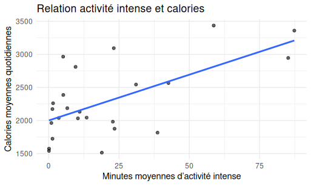

# Bellabeat : Analyse du Bien-être Holistique (Étude de cas Google)
 En analysant les données Fitbit, j'ai découvert que si l'activité intense booste les calories, elle ne garantit pas un meilleur sommeil. J'ai donc élaboré une stratégie pour Bellabeat visant à passer d'un simple suivi de performance à une approche holistique, centrée sur la récupération et l'équilibre global de l'utilisatrice.

## Introduction
Ce projet explore les données des dispositifs connectés Fitbit pour identifier des opportunités stratégiques pour **Bellabeat**. L'analyse se divise en deux étapes : une étude des comportements quotidiens, suivie d'une analyse approfondie des moyennes individuelles.

## Outils & Méthodologie
* **Excel** : Nettoyage préliminaire.
* **SQL (BigQuery)** : Agrégation des données par utilisateur (Calcul des moyennes `avg`).
* **R (tidyverse)** : Modélisation statistique et visualisations.

## Phase 1 : Analyse des comportements quotidiens
En utilisant les variables `sleep_hours`, `light_minutes` et `very_minutes` sur l'ensemble des observations :
* **Résultat** : L'activité légère n'a aucune influence sur la durée du sommeil ($p=0.50$).
* **Observation** : Les utilisatrices sont actives, mais cela ne se traduit pas automatiquement par une récupération plus longue.

## Phase 2 : Analyse Approfondie (Données Agrégées)
L'utilisation du fichier finalisé `bq_activity_sleep_calories.csv` (incluant `avg_sleep_minutes`) confirme ces tendances à l'échelle de l'individu :
* **Calories vs Intensité** : Seule l'activité intense (`avg_very_active_minutes`) est un levier de dépense énergétique significatif ($p < 0.01$).
* **Résultat Clé** : L'intensité comme moteur de performance

L'analyse la plus significative de ce projet concerne la dépense énergétique. Contrairement au sommeil ou à l'activité légère, l'activité intense présente une corrélation linéaire forte avec les calories brûlées.

### 1  Relation entre Activité Intense et Calories
* **Constat statistique** : La variable `avg_very_active_minutes` possède une p-value inférieure à 0.01, confirmant son rôle déterminant.
* **Interprétation business** : Pour Bellabeat, cela signifie que la promotion de séances de sport intensives (HIIT, cardio) est plus efficace pour les utilisatrices ayant un objectif de perte de poids que le simple comptage des pas (activité légère).

  
   <em>Graphique : Relation entre les minutes d'activité intense et la dépense calorique moyenne.</em>

### 2 Synthèse des autres modèles
En parallèle, l'étude montre que :
1. **Le Sommeil (avg_sleep_minutes)** : Reste indépendant de l'activité physique mesurée (p=0.80), suggérant que le repos dépend de facteurs holistiques (stress, environnement).
2. **L'Activité Légère** : Bien qu'elle représente 63% du temps des utilisatrices, elle n'impacte pas significativement la dépense énergétique globale.
#### **Modèle Holistique** : En combinant l'activité et les calories pour prédire le sommeil, le modèle affiche une **p-value de 0.80**. Le sommeil est une variable indépendante de l'effort physique mesuré ici.

## Limitations Critiques
* **Biais de l'échantillon** : Nous disposons d'un grand volume de données temporelles, mais pour seulement **30 utilisateurs**. Les conclusions peuvent donc être fortement influencées par des profils atypiques.
* **Données isolées** : L'absence de données sur le stress ou l'alimentation limite l'interprétation du sommeil.

## Recommandations Stratégiques
1. **Focus Holistique** : Bellabeat doit se positionner sur la "gestion de l'énergie" plutôt que sur la simple "performance sportive".
2. **Qualité du Sommeil** : Intégrer des conseils sur l'hygiène de sommeil non-physique (température, exposition aux écrans) car le sport seul ne semble pas être le moteur du repos.
3. **Marketing de l'Intensité** : Valoriser des séances de sport courtes et intenses pour les femmes actives cherchant à optimiser leur dépense calorique.
